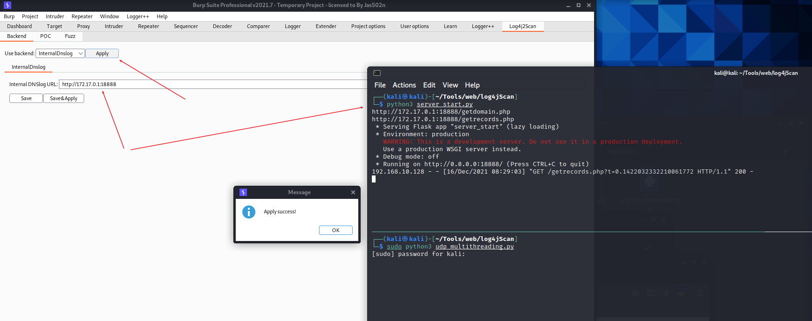

# Log4j2Scan_IntranetScanEdition


> 本工具仅供学习研究自查使用，切勿用于非法用途，由使用该工具产生的一切风险均与本人无关！


[English](./README.md) | 简体中文

Log4j2 远程代码执行漏洞，BurpSuite被动扫描插件，内网版本（不依赖DNSLog），企业内部自查适用。


# 食用方法：


```shell
# 修改监听ip为内网ip，启动内网echo server
python3 server_start.py

# 修改监听ip为内网ip，启动udp监听器
sudo python3 udp_multithreading.py

# 初始化日志文件
echo '' > log
```

配置内网echo服务器的地址：



选择POC和fuzz(略)

Proxy -> 选择要扫描的url -> 右键Do passive scan


# 效果截图：


# 参考：

Project fork from: https://github.com/whwlsfb/Log4j2Scan


思路来源: 流浪猫@[流浪猫收容所](https://mp.weixin.qq.com/s/gij9ckgCCp76Vx8kOB68iA)


