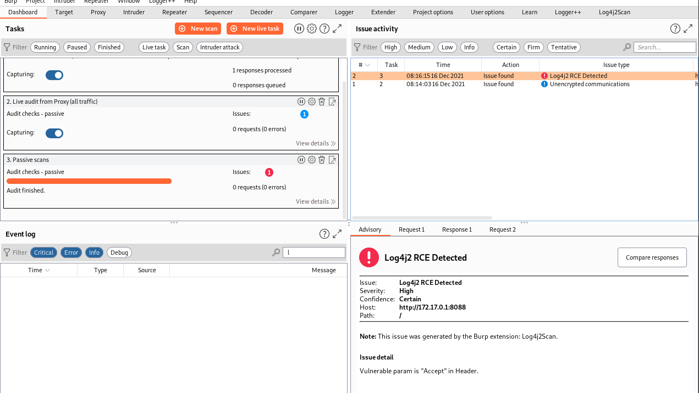

# Log4j2Scan_IntranetScanEdition

> This tool is only for learning, research and self-examination. It should not be used for illegal purposes. All risks arising from the use of this tool have nothing to do with me!


English | [简体中文](./README-zh_CN.md)

Log4j2 Remote Code Execution Vulnerability, Passive Scan Plugin for BurpSuite. Intranet Scanning Edition.


# Usage：


```shell
# Change to your inter ip，Setting up intranet echo server
python3 server_start.py

# Change to your inter ip，Setting up intranet udp multithreading listener
sudo python3 udp_multithreading.py

# Initial log file
echo '' > log
```

Change the Dnslog url to you internal echo service url：


choose you poc and fuzzing options

Proxy -> select url -> Do passive scan


# Screenshot：





# Acknowledgements：

Project fork from: https://github.com/whwlsfb/Log4j2Scan

Learn from: 流浪猫@[流浪猫收容所](https://mp.weixin.qq.com/s/gij9ckgCCp76Vx8kOB68iA)


